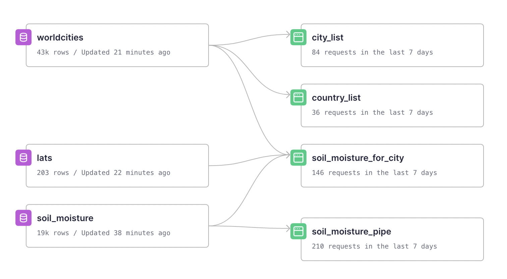
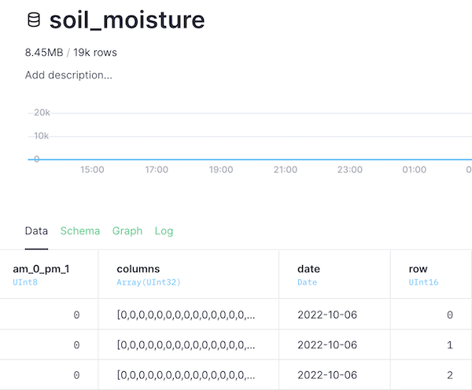

# Using Tinybird to see Soil Moisture from Space

by Alison Davey

## Hackathon

This project is for Tinybird's first hackathon ["To Infinity and beyond"](https://www.tinybird.co/events/tinybird-hackathon).

The theme is **space**. An important part of activity in space is observing the Earth. In this project, satellite data measuring soil moisture across the globe is shown on global maps.

## The App

The satellite data stored in Tinybird powers the [HEX](https://app.hex.tech/138d7e08-1b21-474f-a78c-baee6d4bfc2a/app/8b9f85a8-3841-4162-9471-ede3ae685576/latest) app.

For the selected day you see the results of the morning pass of the satellite, the afternoon pass, the two passes combined and finally a plot of several days data to fill in the blanks.


You can also select a country and city to show a more local area and a bar plot of the soil moisture numbers for that city.

## The Data

NASA's Soil Moisture Active Passive (SMAP) satellite uses two microwave instruments to monitor the top 2 inches (5 centimeters) of soil on Earth's surface. Together, the instruments create soil moisture estimates with a resolution of about 6 miles (9 kilometers), mapping the entire globe every two or three days.

These plots are of the Level-3 (L3) soil moisture data, which is a composite of daily estimates of global land surface conditions. SMAP L-band soil moisture data are resampled to a global, cylindrical 36 km Equal-Area Scalable Earth Grid (406 rows x 964 columns). 

The NASA National Snow and Ice Data Center Distributed Active Archive Center (NSIDC DAAC) distributes cryosphere and related geophysical data from NASA Earth-observing satellite missions, airborne campaigns, and field observations. 

_NASA's [SMAP viewer](https://smap.jpl.nasa.gov/map/) is not currently working, so let's build our own!_

#### Citation

O'Neill, P. E., S. Chan, E. G. Njoku, T. Jackson, R. Bindlish, and J. Chaubell. (2021). SMAP L3 Radiometer Global Daily 36 km EASE-Grid Soil Moisture, Version 8 [Data Set]. Boulder, Colorado USA. NASA National Snow and Ice Data Center Distributed Active Archive Center. https://doi.org/10.5067/OMHVSRGFX38O. Date Accessed 10-23-2022.

The table of cities is from the [World Cities Database](https://simplemaps.com/data/world-cities).

## Create a Tinybird account

Go to [Tinybird](https://www.tinybird.co/) and create a free account, if don't already have one. Either create a new workspace or use an existing one.

## Project setup

**`workspace` directory**

The SQL Pipe and Data Source schema needed to build the project.

**`scripts` directory**

- python script to download the data and send it to Tinybird. You will need to set up an [Earthdata login](https://urs.earthdata.nasa.gov/oauth/authorize) to have your {UID} and {PASSWORD}. Use the Tinybird {TOKEN} from your workspace. Store the values in your `.env` file.

- python script of the plot commands used in the [HEX](https://app.hex.tech/138d7e08-1b21-474f-a78c-baee6d4bfc2a/app/8b9f85a8-3841-4162-9471-ede3ae685576/latest) app.

## Initialize project

1. Clone repository in a virtual environment

```sh
virtualenv -p python3.8 .e

. .e/bin/activate

git clone https://github.com/AlisonDavey/soil_moisture.git
```

2. Authenticate using Tinybird's CLI

```sh
pip install tinybird-cli
```

```sh
cd soil_moisture/workspace
```

```sh
tb auth --token $TOKEN
```

3. Push project to Tinybird

```sh
tb push
```



## Push soil moisture data

Download, preprocess and push the data to Tinybird using the script `script/soil_moisture_data_to_tinybird.py`. The script downloads the data file for each day from 6 October 2022 to 28 October 2022. Each file is 30 MB - 35 MB in `h5` format. Selecting just the data we want and storing that in Tinybird is less than 400 KB per day. Make sure you have created your `.env` file with the {UID} amd {PASSWORD} for your Earthdata login and your Tinybird {TOKEN}.

```sh
cd ..
python scripts/soil_moisture_data_to_tinybird.py
```



Each record is a row of data, with:
- the flag for the morning or the afternoon pass of the satellite
- an integer array of the 964 column values of soil moisture
- the date of the pass
- the row number for each of the 406 rows.

## Dimension files

To support selecting data for more local areas the dimension tables were loaded to Tinybird from the UI by appending data to the empty tables created in step 1:
- `worldcities` from the CSV file downloaded from https://simplemaps.com/data/world-cities
- `lats` an approximate latitude value for each row of data. This was created from a single file of soil moisture data
`pd.DataFrame((pd.DataFrame(group['latitude_centroid_pm'][()])).replace(-9999.0,0).max(axis=1)[:203]).to_csv('lats.csv')`

## Soil moisture for a local area
- the pipe `country_list` serves a list of countries to the country dropdown in the app
- the pipe `city_list` serves a list of cities to the city dropdown in the app, for the selected country
- the pipe `soil_moisture_for_city` returns the time series of the soil moisture data for a single cell, close to the selected city, for the bar plot.

## Sources

* [Elena Torro's entry](https://github.com/elenatorro/asteroids-k-means-clustering) for the readme and project structure
* [NASA's SMAP Documentation](https://nsidc.org/data/spl3smp/versions/8)
* [World Cities Database](https://simplemaps.com/data/world-cities)
